# Deploying a Full-Stack Application Using FastAPI, PostgreSQL, React, and Docker

## Table of Contents

1. [Introduction](#introduction)
2. [Definition of Full-Stack Development](#definition-of-full-stack-development)
3. [Importance of Deployment](#importance-of-deployment)
4. [Overview of FastAPI and React](#overview-of-fastapi-and-react)
5. [Role of Docker and Docker Compose in Deployment](#role-of-docker-and-docker-compose-in-deployment)
6. [Requirements](#requirements)
7. [Comprehensive Guide for Backend Setup, Frontend Setup, and Dockerization](#comprehensive-guide-for-backend-setup-frontend-setup-and-dockerization)
    * [Backend Setup with FastAPI and PostgreSQL](#backend-setup-with-fastapi-and-postgresql)
    * [Dockerization of the Backend Application](#dockerization-of-the-backend-application)
    * [Frontend Setup with ReactJS and ChakraUI](#frontend-setup-with-reactjs-and-chakraui)
    * [Setting Up the Server for Deployment](#setting-up-the-server-for-deployment)
    * [Using Docker Compose for Orchestration](#using-docker-compose-for-orchestration)
    * [Optimizing for Production](#optimizing-for-production)
    * [Security Considerations](#security-considerations)
8. [Conclusion](#conclusion)
9. [Recap of Major Steps](#recap-of-major-steps)
10. [Benefits of Using Docker and Docker Compose](#benefits-of-using-docker-and-docker-compose)
11. [Future Improvements and Scaling](#future-improvements-and-scaling)
12. [Additional Resources and Learning Paths](#additional-resources-and-learning-paths)

## Introduction

In today's rapidly evolving tech landscape, the ability to deploy scalable and efficient applications is crucial. This article explores the process of deploying a full-stack application using FastAPI for the backend, PostgreSQL as the database, and React for the frontend. These components are containerized using Docker and orchestrated with Docker Compose. By the end of this guide, you'll have a comprehensive understanding of how to set up and deploy a modern web application, leveraging the power of containerization for both development and production environments.

## Definition of Full-Stack Development

Full-stack development refers to the practice of developing both the frontend and backend parts of a web application. It involves working with databases, server-side logic, APIs, and user interfaces. Full-stack developers have the skills to create complete, end-to-end solutions, from user experience to data management.

## Importance of Deployment

Deployment is the process of making an application available for users. It involves setting up the necessary infrastructure, configuring servers, and ensuring that the application runs smoothly in a production environment. Proper deployment practices enable applications to scale efficiently, handle traffic, and maintain reliability.

## Overview of FastAPI and React

**FastAPI** is a modern, high-performance web framework for building APIs with Python 3.7+ based on standard Python-type hints. It is easy to use, simple to set up, and offers excellent performance, making it a popular choice for backend development.

**React** is a JavaScript library for building user interfaces, primarily for single-page applications. It allows developers to create large web applications that can update and render efficiently in response to data changes.

## Role of Docker and Docker Compose in Deployment

**Docker** is a platform that enables developers to package applications into containers, which are standardized units of software that include everything needed to run an application. Docker Compose is a tool for defining and running multi-container Docker applications, allowing developers to define their services, networks, and volumes in a single file and easily manage the lifecycle of an application stack.

## Requirements

1. **Write Dockerfiles to Containerize Both the React Frontend and FastAPI Backend**

    * Ensure each service can be built and run locally in their respective containers.

2. **Deploy Your Dockerized Application to an AWS EC2 Instance**

    * Set up a domain for your application. If you don't have a domain, get a free subdomain from Afraid DNS.

    * Configure HTTP to redirect to HTTPS.

    * Configure www to redirect to non-www.

3. **Configure Nginx Proxy Manager**

    * Serve the frontend and backend on the same host machine port (80).

    * Serve the frontend on the root (/).

    * Proxy `/api` on the backend to `/api` on the main domain.

    * Proxy `/docs` on the backend to `/docs` on the main domain.

    * Proxy `/redoc` on the backend to `/redoc` on the main domain.

4. **Configure the Application to Use a PostgreSQL Database**

    * Ensure the database is properly set up and connected.

5. **Adminer Setup**

    * Configure Adminer to run on port 8080.

    * Ensure Adminer is accessible via the subdomain `db.domain` and is properly connected to the PostgreSQL database.

6. **Proxy Manager Setup**

    * Configure the proxy manager to run on port 8090.

    * Ensure the proxy manager is accessible via the subdomain `proxy.domain`.

### Testing

The repository will be cloned and tested by running `docker-compose up -d`.

## Comprehensive Guide for Backend Setup, Frontend Setup, and Dockerization

### Backend Setup with FastAPI and PostgreSQL

#### Prerequisites

Before starting, ensure you have the following:

* **Python 3.8 or higher**: Confirm that Python 3.8+ is installed on your system.

* **Poetry**: Used for dependency management.

* **PostgreSQL**: Ensure the database server is running.

#### Installing Poetry

Poetry simplifies dependency management and packaging in Python. To install Poetry, run:

```bash
curl -sSL https://install.python-poetry.org | python3 -
```

After installation, make sure Poetry's path is added to your system's PATH variable if it is not automatically done.

#### Setup Instructions

1. **Navigate to the Backend Directory**: Change your current working directory to the backend directory of your project.

    ```bash
    cd backend
    ```

2. **Install Dependencies Using Poetry**: Install the project dependencies defined in `pyproject.toml`.

    ```bash
    poetry install
    ```

3. **Set Up the Database**: Execute the `prestart.sh` script to set up the necessary database tables.

    ```bash
    poetry run bash ./prestart.sh
    ```

4. **Run the Backend Server**: Start the FastAPI application using Uvicorn with live reload enabled.

    ```bash
    poetry run uvicorn app.main:app --reload
    ```

5. **Update Configuration**: Modify the `.env` file to include necessary configurations, especially for the database.

### Dockerization of the Backend Application

This section explains how to containerize the backend application using Docker, ensuring a consistent and isolated environment.

#### Dockerfile Breakdown

**Base Image**

```dockerfile
FROM python:3.10-slim-bullseye
```

Uses `python:3.10-slim-bullseye` as the base image for a lightweight and secure container.

**Set Working Directory**

```dockerfile
WORKDIR /app
```

Sets `/app` as the working directory inside the container.

**Install Poetry**

```dockerfile
RUN pip install poetry && \
    poetry config virtualenvs.create false
```

Installs Poetry and configures it to not create virtual environments inside the container.

**Copy Poetry Configuration Files**

```dockerfile
COPY ./pyproject.toml ./poetry.lock* ./
```

Copies `pyproject.toml` and `poetry.lock` to the container, defining the project's dependencies.

**Copy Application Code**

```dockerfile
COPY . .
```

Copies the application code to the container's working directory.

**Install Dependencies**

```dockerfile
RUN poetry install
```

Installs the project dependencies defined in `pyproject.toml`.

**Expose Port**

```dockerfile
EXPOSE 8000
```

Indicates that the container listens on port 8000.

**Run Prestart.sh and Start Uvicorn Server**

```dockerfile
CMD ["sh", "-c", "poetry run bash ./prestart.sh && poetry run uvicorn app.main:app --host 0.0.0.0 --port 8000 --reload"]
```

Executes the `prestart.sh` script to set up the database tables and starts the FastAPI application using Uvicorn.

This comprehensive guide ensures a smooth development and deployment workflow by covering both the setup of the backend environment and the dockerization process.

### Frontend Setup with ReactJS and ChakraUI

#### Prerequisites

Before you start, make sure you have the following installed:

* **Node.js** (version 14.x or higher)

* **npm** (version 6.x or higher)

* **Docker** (latest version recommended)

#### Setup Instructions

**Local Development**

1. **Navigate to the Frontend Directory**:

    ```bash
    cd frontend
    ```

2. **Install Dependencies**:

    ```bash
    npm install
    ```

3. **Run the Development Server**:

    ```bash
    npm run dev
    ```

4. **Configure API URL**:

    Ensure the API URL is correctly set in the `.env` file for the frontend to communicate with the backend services.

**Using Docker**

To build and run the application using Docker, follow these steps:

1. **Build the Docker Image**:

    ```bash
    docker build -t frontend-app .
    ```

2. **Run the Docker Container**:

    ```bash
    docker run -p 5173:5173 frontend-app
    ```

#### Dockerfile Breakdown

The Dockerfile for this application uses a multi-stage build process to create a lean and efficient Docker image.

**Stage 1: Build Stage**

```dockerfile
FROM node:current-slim AS builder
WORKDIR /app
COPY ./package.json ./package-lock.json ./
RUN npm install
COPY . .
```

* **Base Image**: Uses `node:current-slim` for a lightweight Node.js environment.

* **Working Directory**: Sets `/app` as the working directory.

* **Dependencies**: Copies `package.json` and `package-lock.json`, then runs `npm install` to install dependencies.

* **Application Code**: Copies the application source code into the container.

**Stage 2: Run Stage**

```dockerfile
FROM node:current-slim
WORKDIR /app
COPY --from=builder /app ./
EXPOSE 5173
CMD ["npm", "run", "dev", "--", "--host"]
```

* **Base Image**: Uses `node:current-slim` again for runtime.

* **Working Directory**: Sets `/app` as the working directory.

* **Copy Artifacts**: Copies the built application and installed dependencies from the build stage.

* **Expose Port**: Indicates that the container listens on port 5173.

* **Start Command**: Specifies the command to start the application in development mode, making it accessible on port 5173.

This guide provides a comprehensive walkthrough for setting up and running the frontend of your application both locally and using Docker. By following these instructions, you can ensure a consistent environment for development and deployment, leveraging the benefits of containerization with Docker.

### Setting Up the Server for Deployment

Successfully deploying your application requires preparing the server environment to host and run your Dockerized application efficiently. This involves choosing the right server infrastructure, configuring necessary security measures, and ensuring your server is ready to handle production traffic.

#### Choosing the Right Server

**Select a Cloud Provider**:

Evaluate options like AWS, Google Cloud Platform, Azure, or DigitalOcean based on your needs and budget. Consider factors such as pricing, scalability, geographical server locations, and available services. For this deployment, an AWS VM is used.

**Choose the Server Type**:

* **Virtual Machines (VMs)**: Traditional choice with full control over the operating system and configurations.

* **Managed Container Services**: Use services like AWS ECS, Google Kubernetes Engine, or Azure AKS for managing Docker containers. In this deployment, a Virtual Machine (VM) is used.

**Select Instance Size**:

Determine the CPU, memory, and storage requirements based on the expected application load. Start with a smaller instance size for cost-efficiency and scale up as needed. In this deployment, a T2.medium instance is used.

#### Configuring the Server

**Set Up SSH Access**:

During the setup of the AWS instance, choose to set up a key pair, and a `private-key.pem` will be downloaded on your local PC.

**Install Required Software**:

* Docker: Install Docker on the server to run your containers.

* Docker Compose: Ensure Docker Compose is installed for orchestrating multi-container applications.

Example for Ubuntu:

```bash
sudo apt-get update
sudo apt-get install -y docker.io
sudo curl -L "https://github.com/docker/compose/releases/download/1.29.2/docker-compose-$(uname -s)-$(uname -m)" -o /usr/local/bin/docker-compose
sudo chmod +x /usr/local/bin/docker-compose
```

**Configure Firewall Rules**:

During the AWS VM setup, create a security group and add rules that open necessary ports for application access (e.g., HTTP, HTTPS, SSH, and TCP ports 8000, 8080, 8090, and 5173).

**Set Up a Domain Name (Optional)**:

Purchase a domain name and configure DNS settings to point to your server's IP address. Create A records pointing the `domain-name`, `db.domain-name`, `proxy.domain-name`, and `www.domain-name` to the AWS server's public IP address.

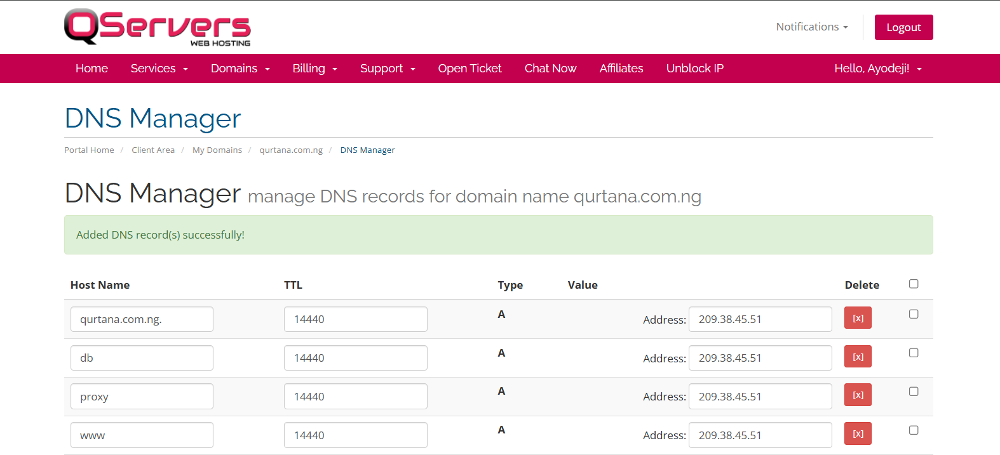

#### Preparing for Deployment

**Transfer Code and Assets**:

Use Git to clone the application repository to the server. Alternatively, use secure file transfer methods like `scp` or `rsync` to move files.

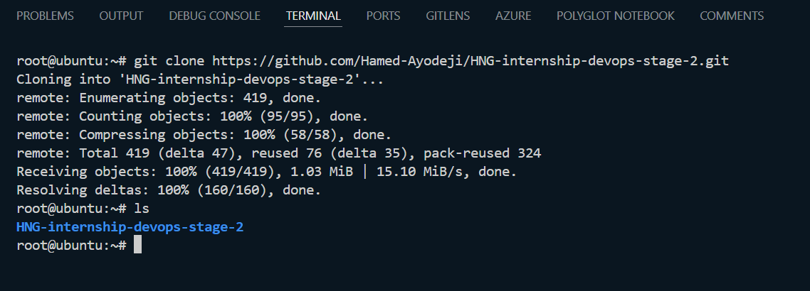

**Set Environment Variables**:

Create a `.env` file on the server to store environment-specific variables. Ensure sensitive information, such as API keys and database credentials, is stored securely. In this deployment, the `.env` files are in the respective backend and frontend directories. This is not a best practice, but it is sufficient for learning purposes.

### Using Docker Compose for Orchestration

#### Writing a Docker Compose File

The `docker-compose.yml` file is the blueprint for your application’s services. It defines how each service is built, configured, and connected. Here’s a breakdown of the key components of your `docker-compose.yml` file:

```yaml
version: '3.8'

services:
  backend:
    build: ./backend
    ports:
      - "8000:8000"
    depends_on:
      - db
    env_file:
      - ./backend/.env

  frontend:
    build:
      context: ./frontend
    ports:
      - "5173:5173"
    env_file:
      - ./frontend/.env

  db:
    image: postgres:17beta1-alpine
    ports:
      - "5432:5432"
    volumes:
      - postgres_data:/var/lib/postgresql/data
    env_file:
      - ./backend/.env

  adminer:
    image: adminer
    ports:
      - "8080:8080"

  proxy:
    image: jc21/nginx-proxy-manager:latest
    container_name: nginx_proxy_manager
    ports:
      - "80:80"
      - "443:443"
      - "8090:81"
    environment:
      DB_SQLITE_FILE: "/data/database.sqlite"
    volumes:
      - ./data:/data
      - ./letsencrypt:/etc/letsencrypt

volumes:
  postgres_data:
  data:
  letsencrypt:
```

#### Defining Services: Backend and Frontend

In your `docker-compose.yml`, the `services` section defines individual components of your application:

**Backend**:

* **Build Configuration**: The backend service is built from the `./backend` directory using the specified Dockerfile.

* **Ports**: Exposes port 8000 on the host machine, mapped to the FastAPI application running inside the container.

* **Environment Variables**: Loads environment variables from the `.env` file in the `./backend` directory.

* **Dependencies**: Specifies that the backend service depends on the database service, ensuring that the database starts before the backend.

**Frontend**:

* **Build Configuration**: The frontend service is built from the `./frontend` directory using the specified Dockerfile.

* **Ports**: Exposes port 5173 on the host machine, which corresponds to the development server for the React application.

* **Environment Variables**: Loads environment variables from the `.env` file in the `./frontend` directory.

#### Volume and Network Configuration

Docker volumes and networks provide persistent storage and communication between services:

**Volumes**:

* **postgres\_data**: Stores PostgreSQL data, ensuring persistence across container restarts.

* **data**: Used by the Nginx Proxy Manager to persist configuration and data.

* **letsencrypt**: Stores SSL certificates managed by the Nginx Proxy Manager.

**Networks**:

Docker Compose automatically creates a default network for all services, allowing them to communicate with each other using service names as hostnames.

#### Running Docker Compose

1. Navigate to the cloned repository containing the `docker-compose.yml` file.

    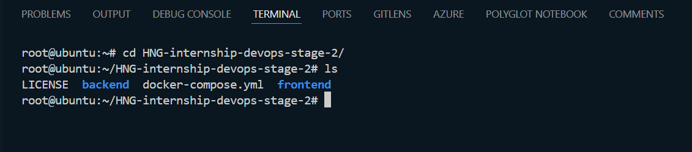

2. Run this command:

    ```bash
    docker-compose up -d
    ```

This will pull and build all the necessary images and run them based on the prescribed configurations in the `docker-compose.yml` file. Use `docker images` to view all the images pulled and built, and `docker ps` to view all the running containers.

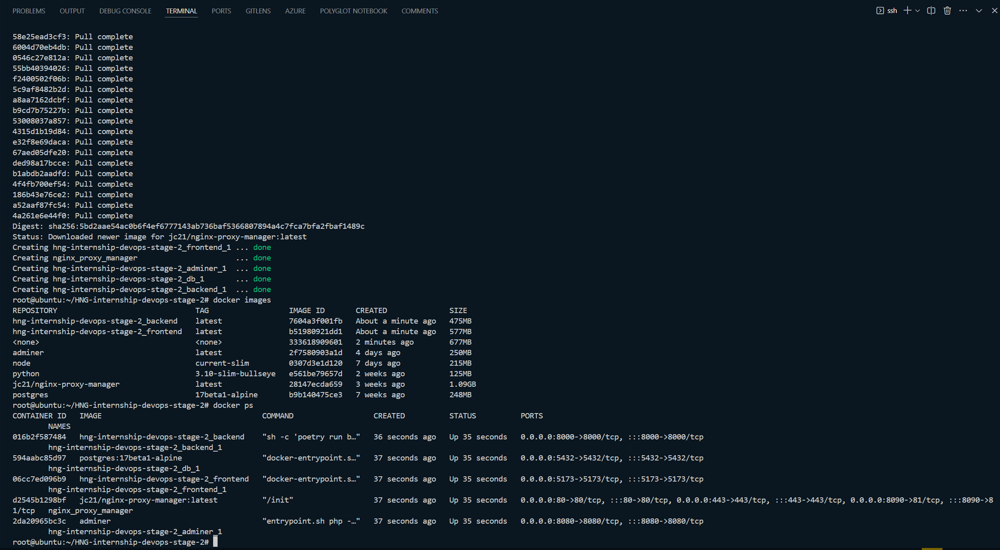

### Optimizing for Production

#### Configuring Nginx as a Reverse Proxy

Visit the domain-name:8090 (replace "domain-name" with the actual domain name you set the A-record for) to access the dashboard of the nginx-proxy-manager, and use the default login credentials to sign in:

* **Email Address**: [admin@example.com](mailto:admin@example.com)

* **Password**: changeme

Once you are signed in, you will be prompted to reset the credentials; proceed and set your new private credentials.

**Steps to Configure the Nginx-proxy-manager**:

1. **Create SSL Certificates**: Go to the SSL Certificates tab and create SSL Certificates for all the domain names.

    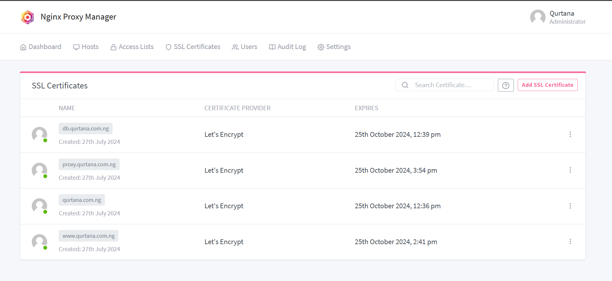

2. **Add Proxy Hosts**:

    * Go to the Dashboard tab and select Proxy Hosts, and add proxy hosts with all the appropriate configurations.

    * Click on Add proxy hosts, input the domain-name, set Forward Hostname / IP to frontend, and the Forward Port to 5173. Toggle the Block common exploits and Websockets support on.

    * In the SSL tab, select the SSL Certificate you created for the domain-name, and toggle the Force SSL and HTTP/2 Support on.

    * In the Advanced tab, add this configuration:

    ```nginx
    location /api {
        proxy_pass http://backend:8000;
        proxy_set_header Host $host;
        proxy_set_header X-Real-IP $remote_addr;
        proxy_set_header X-Forwarded-For $proxy_add_x_forwarded_for;
        proxy_set_header X-Forwarded-Proto $scheme;
    }
    
    location /docs {
        proxy_pass http://backend:8000;
        proxy_set_header Host $host;
        proxy_set_header X-Real-IP $remote_addr;
        proxy_set_header X-Forwarded-For $proxy_add_x_forwarded_for;
        proxy_set_header X-Forwarded-Proto $scheme;
    }
    
    location /redoc {
        proxy_pass http://backend:8000;
        proxy_set_header Host $host;
        proxy_set_header X-Real-IP $remote_addr;
        proxy_set_header X-Forwarded-For $proxy_add_x_forwarded_for;
        proxy_set_header X-Forwarded-Proto $scheme;
    }
    ```

    * This configuration sets the following:

        * Serve the frontend and backend on the same host machine port (80).

        * Serve the frontend on the root (/).

        * Proxy `/api` on the backend to `/api` on the main domain.

        * Proxy `/docs` on the backend to `/docs` on the main domain.

        * Proxy `/redoc` on the backend to `/redoc` on the main domain.

    * Click on Save.

3. **Verify Access**:

    * Visit [`https://domain-name`](https://domain-name) to access the frontend login page.

        

    * Login with the credentials in the backend `.env` file:

        ```nginx
        FIRST_SUPERUSER=devops@hng.tech
        FIRST_SUPERUSER_PASSWORD=devops#HNG11
        ```

    * If you encounter errors while logging in, ensure that the server IP address is added to the backend `.env` CORS variable like this:

        ```nginx
        BACKEND_CORS_ORIGINS="http://localhost,http://localhost:5173,https://localhost,https://localhost:5173,http://209.38.45.51:5173"
        ```

    * Add the [`https://domain-name`](https://domain-name) to the frontend `.env` like this:

        ```nginx
        VITE_API_URL=https://qurtana.com.ng
        ```

    * This should allow you to log in successfully.

        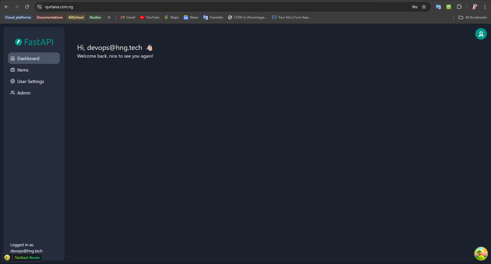

    * [`https://domain-name/api`](https://domain-name/api) takes you to the `/api` on the backend.

        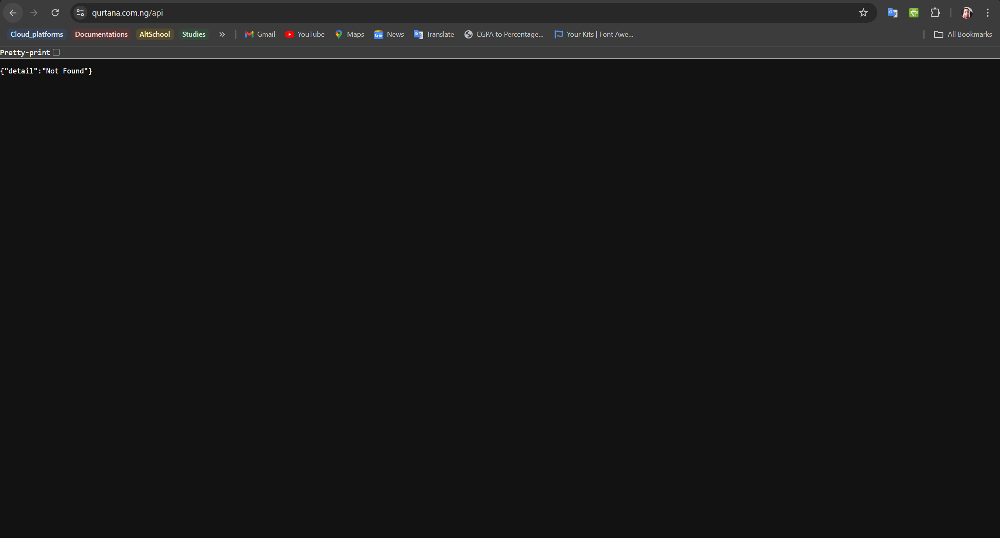

    * [`https://domain-name/docs`](https://domain-name/docs) takes you to the `/docs` on the backend.

        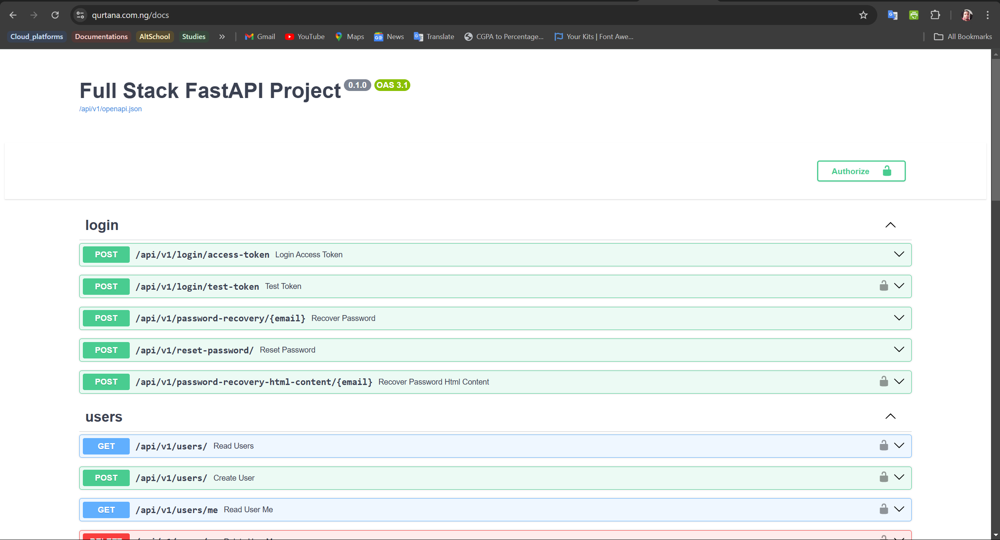

    * [`https://domain-name/redoc`](https://domain-name/redoc) takes you to the `/redoc` on the backend.

        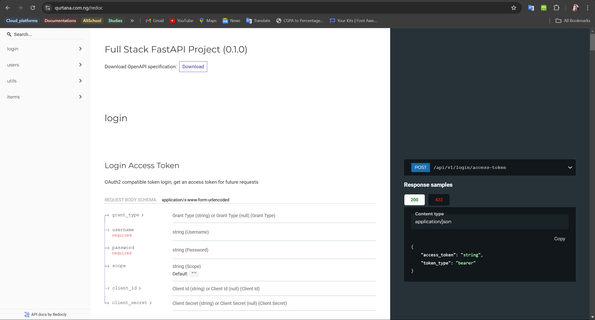

4. **Add Proxy Hosts for Other Services**:

    * For the database, add a proxy host with the `db.domain-name`, set Forward Hostname / IP to adminer, and the Forward Port to 8080. Select the SSL Certificate you created for the `db.domain-name`, and toggle the Force SSL and HTTP/2 Support on.

        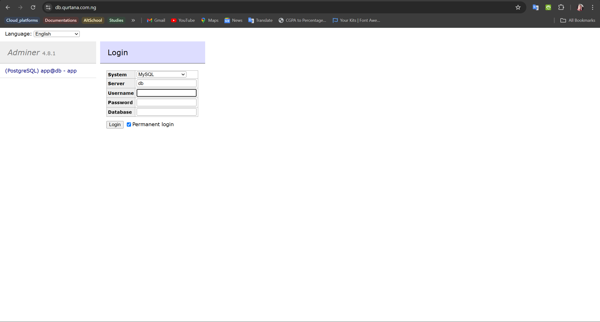

        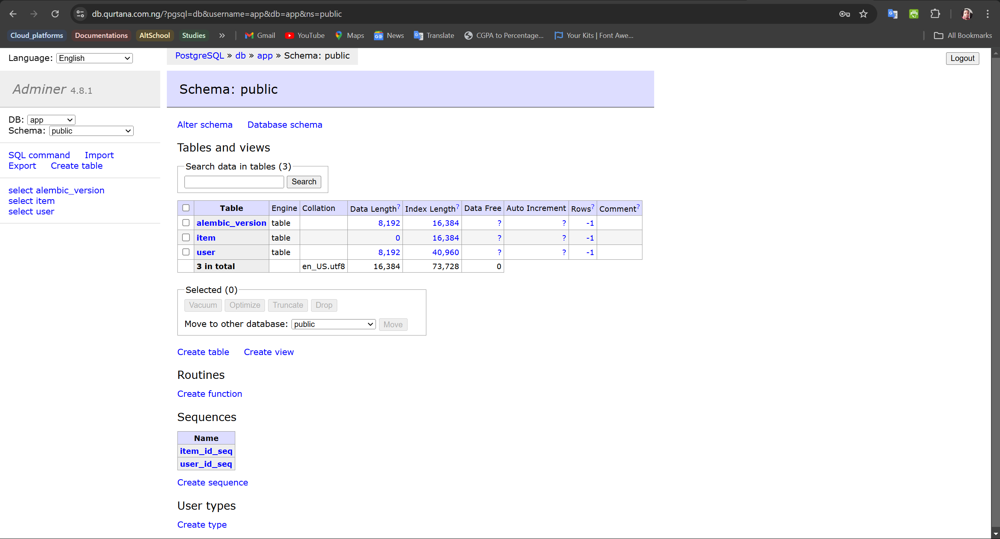

    * For the Nginx-proxy-manager dashboard, add a proxy host with the `proxy.domain-name`, set Forward Hostname / IP to proxy, and the Forward Port to 8090. Select the SSL Certificate you created for the `proxy.domain-name`, and add this configuration to the Advanced tab:

        ```nginx
        location / {
            proxy_pass http://nginx_proxy_manager:81;
            proxy_set_header Host $host;
            proxy_set_header X-Real-IP $remote_addr;
            proxy_set_header X-Forwarded-For $proxy_add_x_forwarded_for;
            proxy_set_header X-Forwarded-Proto $scheme;
        }
        ```

        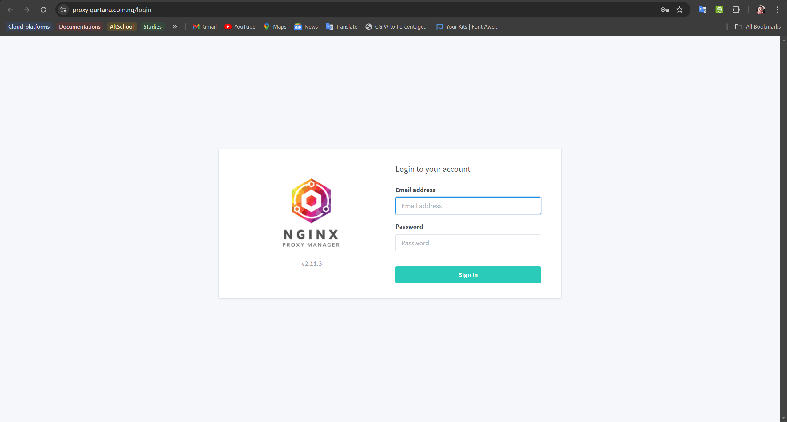

        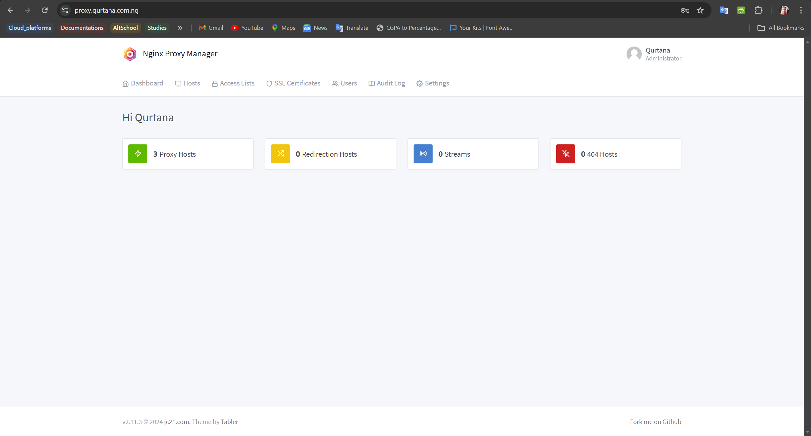

5. **Redirect www to non-www**:

    * Add a proxy host for `www.domain-name`, set Forward Hostname / IP to frontend, and the Forward Port to 5173. Select the SSL Certificate you created for the `www.domain-name`, and click on Save.

    * If the redirection does not work, add this configuration to the Advanced tab:

        ```nginx
        return 301 http://domain-name$request_uri;
        ```

    * Make sure to replace `domain-name` with your registered domain name.

By following this guide, you will successfully deploy a full-stack application using FastAPI, PostgreSQL, React, and Docker. This setup ensures a scalable, efficient, and reliable deployment for your web application.

### Security Considerations

When deploying a full-stack application, security is paramount. Here are key considerations to ensure your application remains secure:

1. **Environment Variables Management**: Use a secure method to store and manage environment variables, such as AWS Secrets Manager or HashiCorp Vault, instead of including them in the source code.

2. **SSL/TLS Encryption**: Ensure all traffic between the client and server is encrypted using SSL/TLS. Nginx Proxy Manager simplifies the process of generating and managing SSL certificates.

3. **Database Security**:

    * Use strong passwords for database access.

    * Regularly update the database system to patch known vulnerabilities.

    * Restrict database access to specific IP addresses.

4. **API Security**:

    * Implement authentication and authorization mechanisms (e.g., JWT tokens).

    * Validate and sanitize user inputs to prevent SQL injection and other attacks.

    * Rate-limit API requests to mitigate brute-force attacks.

5. **Container Security**:

    * Use official and verified Docker images.

    * Regularly scan images for vulnerabilities using tools like Trivy.

    * Implement resource limits to prevent Denial of Service (DoS) attacks.

6. **Network Security**:

    * Configure firewalls to allow only necessary traffic.

    * Use VPNs or private networks for internal communication between services.

    * Regularly audit network policies and configurations.

### Conclusion

In conclusion, deploying a full-stack application using FastAPI, PostgreSQL, and React, containerized with Docker and orchestrated with Docker Compose, provides a scalable and efficient solution for modern web development. This guide covered the essential steps to set up and deploy your application, ensuring a smooth and secure deployment process.

### Recap of Major Steps

1. **Backend Setup**: Installed dependencies, set up the database, and configured the FastAPI application.

2. **Frontend Setup**: Configured the React application and set up ChakraUI for UI components.

3. **Dockerization**: Created Dockerfiles for both backend and frontend, and used Docker Compose to define multi-container applications.

4. **Server Configuration**: Set up an AWS VM, installed necessary software, and configured firewall rules.

5. **Deployment**: Transferred code to the server, set environment variables, and ran Docker Compose to deploy the application.

6. **Optimization**: Configured Nginx as a reverse proxy and secured the application with SSL/TLS certificates.

### Benefits of Using Docker and Docker Compose

1. **Consistency**: Ensures the application runs the same way in development, testing, and production environments.

2. **Isolation**: Containers provide isolated environments, preventing conflicts between dependencies.

3. **Scalability**: Simplifies scaling applications horizontally by adding more container instances.

4. **Portability**: Containers can run on any system that supports Docker, making it easier to move applications between environments.

5. **Simplified Management**: Docker Compose allows easy management of multi-container applications with a single configuration file.

### Future Improvements and Scaling

1. **Load Balancing**: Implement load balancers to distribute traffic across multiple instances of your application.

2. **Kubernetes**: Consider migrating to Kubernetes for advanced orchestration, scaling, and management of containerized applications.

3. **CI/CD Pipelines**: Set up continuous integration and deployment pipelines to automate the build, test, and deployment process.

4. **Monitoring and Logging**: Integrate monitoring and logging solutions like Prometheus, Grafana, and ELK stack to track application performance and diagnose issues.

5. **Security Enhancements**: Continuously review and enhance security measures to protect against new vulnerabilities and threats.

### Additional Resources and Learning Paths

1. **Docker Documentation**: [Docker Docs](https://docs.docker.com/)

2. **FastAPI Documentation**: [FastAPI Docs](https://fastapi.tiangolo.com/)

3. **React Documentation**: [React Docs](https://reactjs.org/docs/getting-started.html)

4. **PostgreSQL Documentation**: [PostgreSQL Docs](https://www.postgresql.org/docs/)

5. **Kubernetes Documentation**: [Kubernetes Docs](https://kubernetes.io/docs/home/)

6. **DevOps Learning Paths**:

    * [AWS DevOps Engineer](https://aws.amazon.com/certification/certified-devops-engineer-professional/)

    * [Google Cloud DevOps Engineer](https://cloud.google.com/certification/devops-engineer)

    * [Azure DevOps Engineer](https://docs.microsoft.com/en-us/learn/certifications/devops-engineer/)
