# Full-Stack FastAPI and React Template

## Table of Contents

- [Project Structure](#project-structure)
- [Getting Started](#getting-started)
- [Docker Configuration](#docker-configuration)
- [AWS Deployment](#aws-deployment)
- [Docker Compose Configuration Documentation: Overview](#docker-compose-configuration-documentation-overview)
  - [Services](#services)
    - [1. PostgreSQL (postgres)](#1-postgresql-postgres)
    - [2. Adminer](#2-adminer)
    - [3. Traefik](#3-traefik)
    - [4. Backend](#4-backend)
    - [5. Frontend](#5-frontend)
  - [Networks](#networks)
  - [Volumes](#volumes)
  - [Environment Variables](#environment-variables)
  - [Traefik Configuration](#traefik-configuration)
  - [Accessing Services](#accessing-services)
  - [Local Development](#local-development)
  - [Security Notes](#security-notes)
  - [Usage](#usage)
  - [Deployment](#deployment)
  - [Testing](#testing)

Welcome to the Full-Stack FastAPI and React template repository. This repository serves as a demo application for interns, showcasing how to set up and run a full-stack application with a FastAPI backend and a ReactJS frontend using ChakraUI.

## Project Structure

The repository is organized into the following main directories:

- **frontend**: Contains the ReactJS application.
- **backend**: Contains the FastAPI application and PostgreSQL database integration.
- **aws-server**: Contains Terraform configuration for AWS EC2 deployment.

Each directory has its own README file with detailed instructions specific to that part of the application.

## Getting Started

To get started with this template, please follow the instructions in the respective directories:

- [Frontend README](./frontend/README.md)
- [Backend README](./backend/README.md)

## Docker Configuration

The `docker-compose.yml` file is located in the root directory of the project. Individual Dockerfiles for the frontend and backend can be found in their respective directories. [Dockerfile for the backend](./backend/Dockerfile) and [Dockerfile for the frontend](./frontend/Dockerfile).

A new `.env` file has been created in the root directory to store environment variables used by the docker-compose file. Ensure this file is properly configured before running the Docker setup.

## AWS Deployment

For the final deployment, an EC2 instance using a t2.medium type has been created. The Terraform configuration for this can be found in the [aws-server](./aws-server/) folder.

## Docker Compose Configuration Documentation: Overview

This docker-compose file sets up a full-stack application environment with the following services:

1. PostgreSQL database
2. Adminer (database management tool)
3. Traefik (reverse proxy and load balancer)
4. Backend service (FastAPI)
5. Frontend service (React)

The setup includes automatic HTTPS configuration, database management, and proper networking between services.

## Services

### 1. PostgreSQL (postgres)

- **Image**: postgres:17beta1-alpine
- **Container Name**: postgresDb
- **Environment Variables**:
  - POSTGRES_USER
  - POSTGRES_PASSWORD
  - POSTGRES_DB
- **Volumes**: postgres_data:/var/lib/postgresql/data
- **Port**: 5432
- **Network**: mynetwork

This service sets up a PostgreSQL database using the Alpine-based image. It uses environment variables from a `.env` file for configuration.

### 2. Adminer

- **Image**: adminer:latest
- **Container Name**: postgresDbAdminer
- **Dependencies**: postgres
- **Port**: 8080
- **Network**: mynetwork
- **Labels**: Configuration for Traefik routing

Adminer provides a web interface for database management. It's configured to work with Traefik for secure access via HTTPS.

### 3. Traefik

- **Image**: traefik:v2.5
- **Container Name**: traefikProxyManager
- **Ports**:
  - 80 (HTTP)
  - 443 (HTTPS)
  - 8090 (Traefik dashboard)
- **Volumes**:
  - Docker socket
  - Let's Encrypt certificates
- **Labels**: Configuration for Traefik dashboard and HTTPS redirection

Traefik acts as a reverse proxy, handling routing and SSL termination. It's configured to automatically obtain and renew SSL certificates using Let's Encrypt.

### 4. Backend

- **Build**: ./backend
- **Image**: backend:fastapi
- **Container Name**: backend
- **Port**: 8000
- **Dependencies**: postgres, traefik
- **Network**: mynetwork
- **Labels**: Configuration for Traefik routing

This service builds and runs the backend application, likely a FastAPI service. It's configured to work with Traefik for routing API requests.

### 5. Frontend

- **Build**: ./frontend
- **Image**: frontend:react
- **Container Name**: frontend
- **Port**: 3000
- **Dependencies**: backend, traefik
- **Network**: mynetwork
- **Labels**: Configuration for Traefik routing

This service builds and runs the frontend application, likely a React app. It's configured to work with Traefik for routing and includes setup for API proxying.

## Networks

- **mynetwork**: A custom bridge network for communication between services.

## Volumes

- **postgres_data**: Persistent storage for PostgreSQL data.
- **letsencrypt**: Storage for Let's Encrypt certificates.

## Environment Variables

The configuration uses a `.env` file for sensitive information and configuration. Key variables include:

- POSTGRES_USER
- POSTGRES_PASSWORD
- POSTGRES_DB
- DOMAIN
- ACME_EMAIL

## Traefik Configuration

Traefik is configured with the following features:

- Automatic HTTPS using Let's Encrypt
- HTTP to HTTPS redirection
- www to non-www redirection
- API and dashboard access
- Docker provider for automatic service discovery

## Accessing Services

- **Adminer**: Accessible at either `http://qurtana.com.ng:8080`

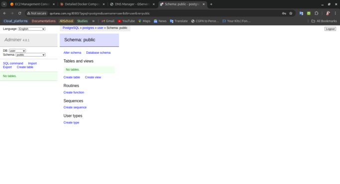

- **Traefik Dashboard**: Accessible at `http://qurtana.com.ng:8090`

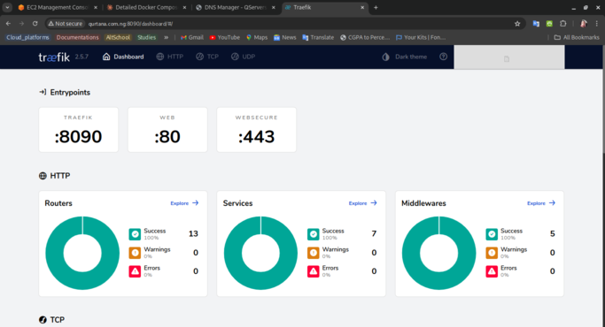

- **Backend API**: Accessible at `https://qurtana.com.ng/api`

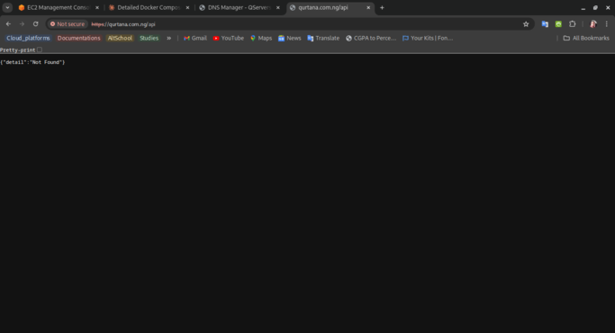

- **Backend docs**: Accessible at `https://qurtana.com.ng/docs`

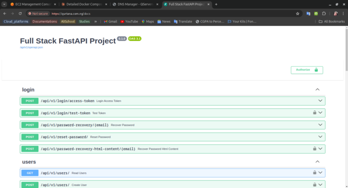

- **Backend redoc**: Accessible at `https://qurtana.com.ng/redoc`

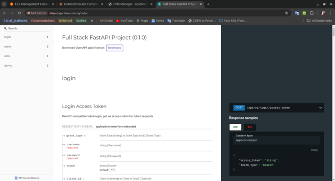

- **Frontend**: Accessible at `https://qurtana.com.ng`

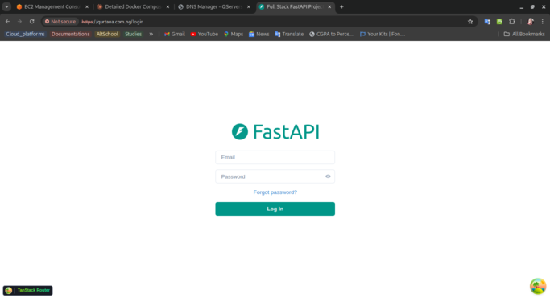

## Local Development

The configuration includes settings for local development:

- Adminer: `http://db.localhost:8080` or `http://localhost:8080`

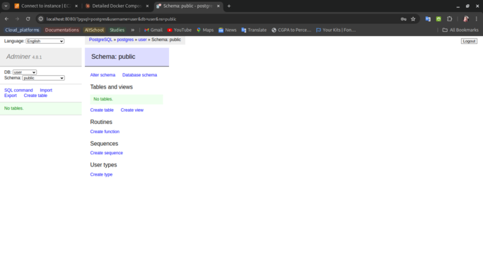

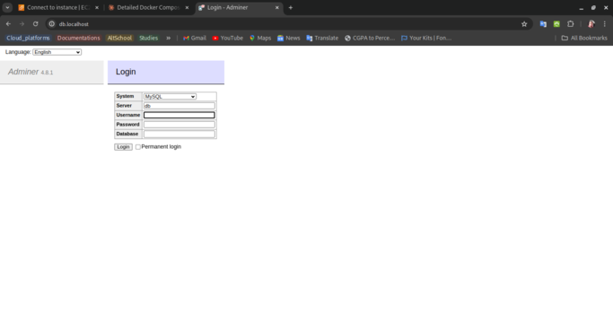

- Traefik Dashboard: `http://proxy.localhost:8090` or `http://localhost:8090`

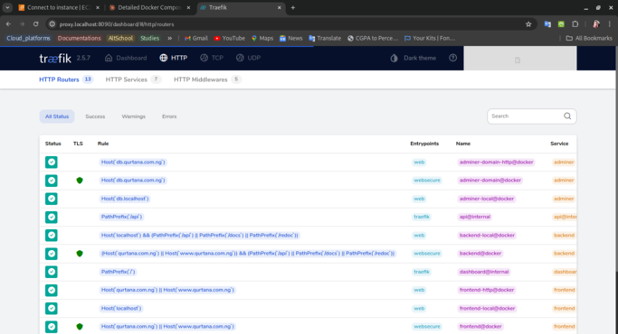

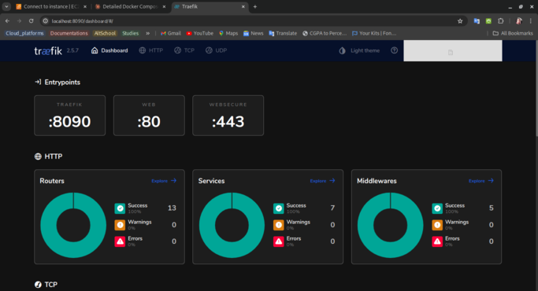

- Backend API: `http://localhost/api`

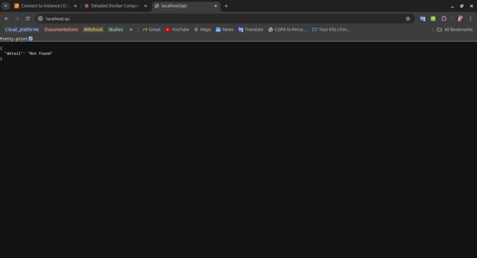

- Backend docs: `http://localhost/docs`

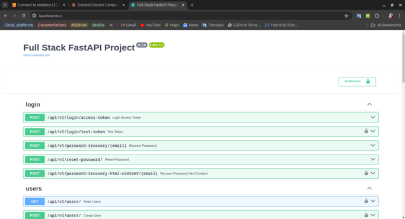

- Backend redoc: `http://localhost/redoc`

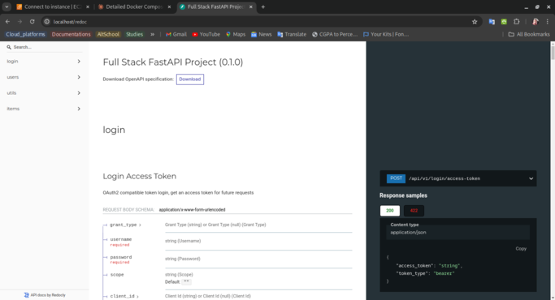

- Frontend: `http://localhost`

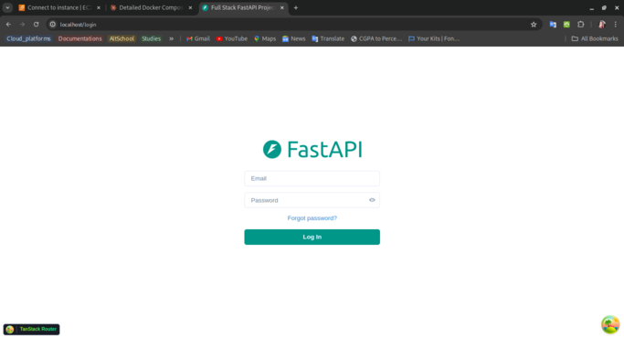

## Security Notes

- Ensure the `.env` file is properly secured and not committed to version control.
- The Traefik API is set to insecure mode (`--api.insecure=true`). In production, consider securing this.
- Review and adjust the exposed ports as needed for your security requirements.

## Usage

To use this Docker setup:

1. Ensure Docker and Docker Compose are installed on your system.
2. Navigate to the root directory of the project.
3. Create a `.env` file in the root directory and add the necessary environment variables.
4. Run `docker-compose up -d` to start all services.
5. Access the services using the URLs mentioned in the "Accessing Services" section.

## Deployment

To deploy this setup:

1. Ensure Docker and Docker Compose are installed on your EC2 instance.
2. Clone the repository to your EC2 instance.
3. Set up the `.env` file with necessary variables in the root directory.
4. Run `docker-compose up -d` to start all services.

Remember to monitor logs and perform regular updates and backups, especially for the database and SSL certificates.

## Testing

Here are screenshots of the various landing pages:

[Insert screenshots here]

These screenshots demonstrate the successful deployment and functionality of:

- The main frontend application
- The backend API documentation (Swagger UI)
- The Adminer database management interface
- The Traefik dashboard
